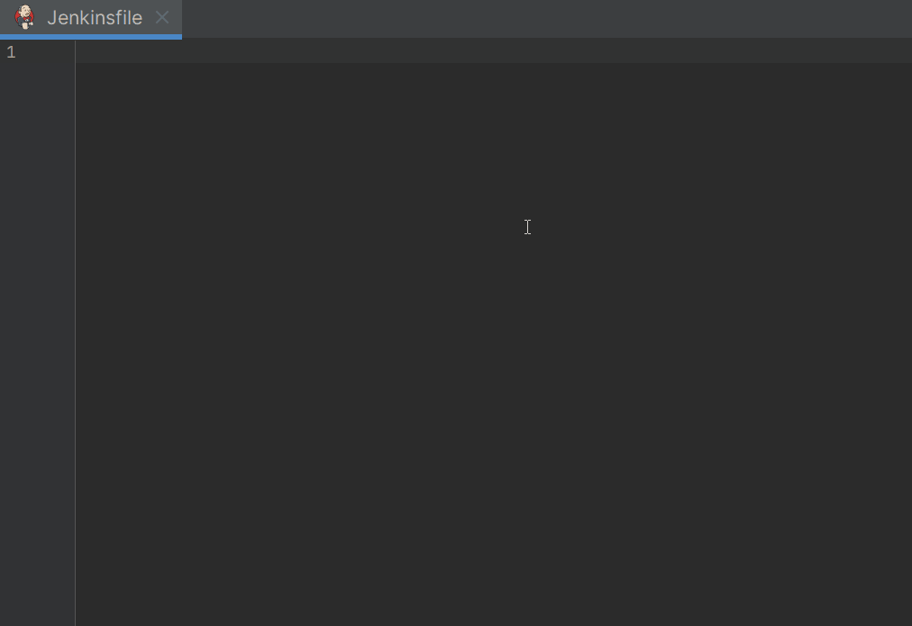
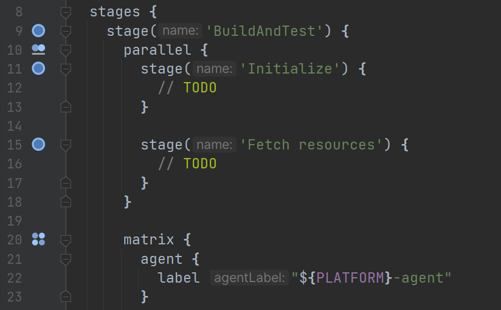
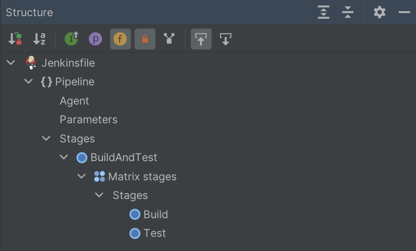

<!--suppress HtmlDeprecatedAttribute -->

# Jenkins Pipeline

Provides support for Jenkins Pipelines (**declarative only** as of now) in Groovy files.

## Development status

The plugin is under active development.

## Preview

### Gutter icons

### Structure view

